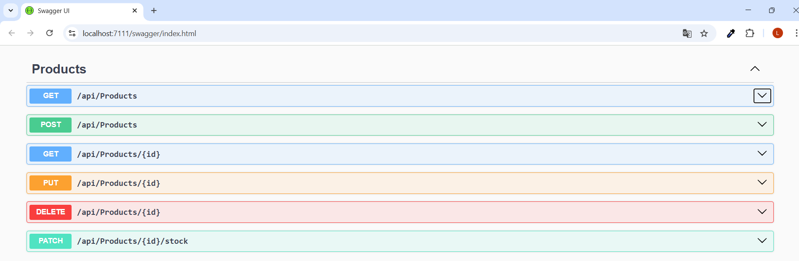
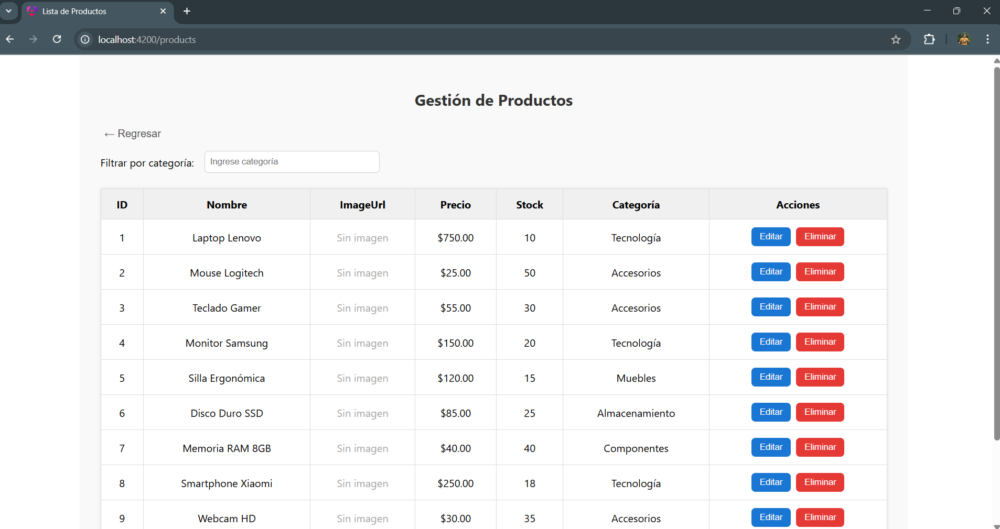
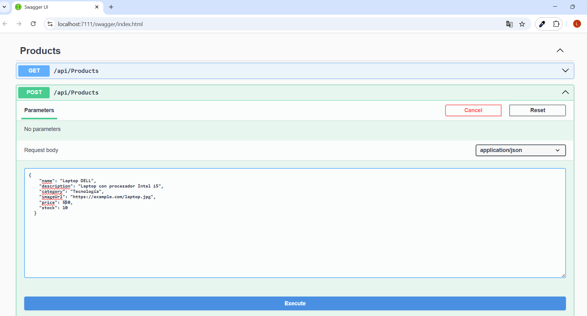
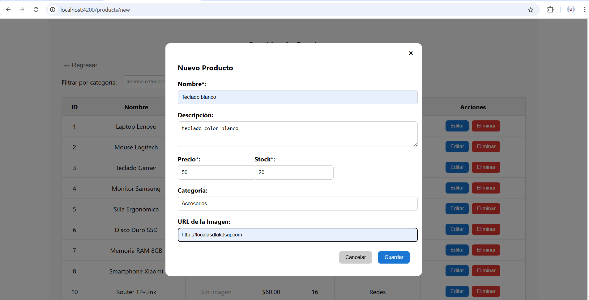
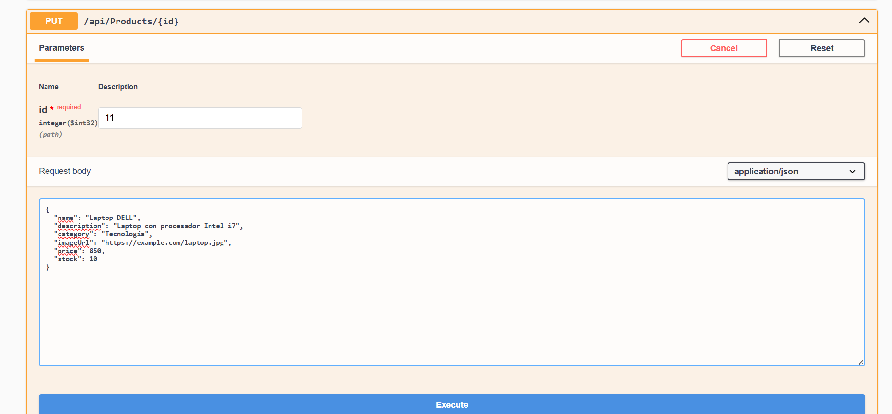
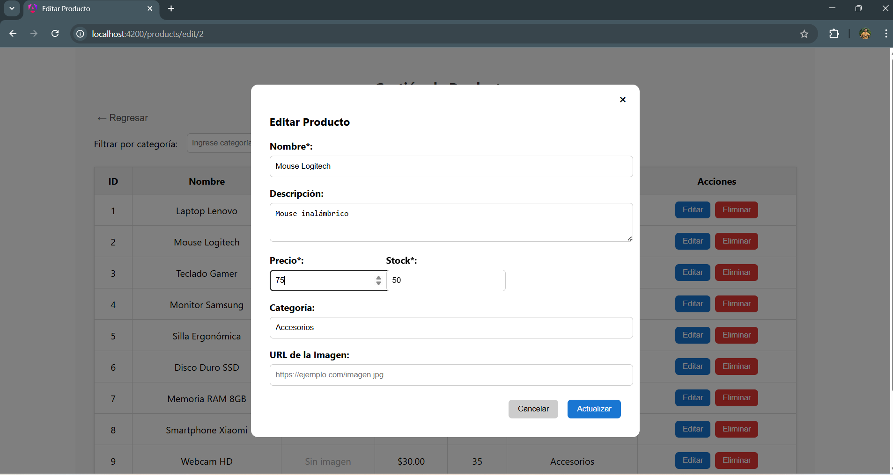

# Sistema de Gestión de Inventario

Aplicación full-stack para la gestión de productos y transacciones de inventario, desarrollada con:
- **Backend**: ASP.NET Core 8 (Microservicios)
- **Frontend**: Angular 18+
- **Base de datos**: SQL Server

 *(opcional: agregar diagrama)*

## Requisitos Técnicos

### Backend (ProductService y TransactionService):
- [.NET 8.0 SDK](https://dotnet.microsoft.com/download/dotnet/8.0)
- [SQL Server 2022](https://www.microsoft.com/en-us/sql-server/sql-server-downloads) o superior
- [Visual Studio 2022 v17.8+](https://visualstudio.microsoft.com/) (con workload ASP.NET)
- [Entity Framework Core 8](https://docs.microsoft.com/en-us/ef/core/)
- [Swagger UI](https://swagger.io/) (incluido en los proyectos)

### Frontend:
- [Node.js v18+](https://nodejs.org/)
- [Angular CLI v18+](https://angular.io/cli)
- [npm v9+](https://www.npmjs.com/) o [pnpm](https://pnpm.io/)
- [TypeScript 5.2+](https://www.typescriptlang.org/)

## Configuración Inicial

# Ejecución del Backend (.NET 8)

## Configuración común:
1. Clonar el repositorio
2. Configurar cadenas de conexión en `appsettings.json` de cada servicio:

\```json
{
  "ConnectionStrings": {
    "InventoryDB": "Server=localhost;Database=InventoryServiceDB;Trusted_Connection=True;TrustServerCertificate=True;"
  },
  "Logging": {
    "LogLevel": {
      "Default": "Information",
      "Microsoft.AspNetCore": "Warning"
    }
  },
  "AllowedHosts": "*"
}
\```

## ProductService
\```bash
cd src/backend/ProductService
dotnet restore
dotnet build
dotnet run
\```

- **Swagger UI:** https://localhost:7111/swagger  
- **Endpoint base:** https://localhost:7111/api/products

## TransactionService
\```bash
cd src/backend/TransactionService
dotnet restore
dotnet build
dotnet run
\```

- **Swagger UI:** https://localhost:7168/swagger  
- **Endpoint base:** https://localhost:7168/api/transactions

# Ejecución del Frontend (Angular 18+)

## Instalación:
\```bash
cd src/frontend/inventory-app
npm install
\```

## Configuración de ambientes:
`src/environments/environment.ts`  
\```typescript
export const environment = {
  production: false,
  productApiUrl: 'https://localhost:7111/api',
  transactionApiUrl: 'https://localhost:7168/api',
  enableDebug: true
};
\```

## Ejecución:
\```bash
ng serve
\```

- **Aplicación disponible en:** http://localhost:4200

## Características Angular 18:
✅ Uso de Signals para estado reactivo  
✅ Standalone Components como arquitectura predeterminada  
✅ Nuevo control de flujo (@if, @for)  
✅ HttpClient con interceptores modernos  
✅ Mejor rendimiento en modo desarrollo

## Evidencias

## Listado dinámico de productos y transacciones con paginación. 

### Backend



[Transaction list ](Capturas-imagenes/Transaction.png)

### Frontend



[Transaction list ](Capturas-imagenes/Transaction-frontend.png)

## Pantalla para la creación de productos. 

### Backend




### Frontend



## Pantalla para la edición de productos.

### Backend



### Frontend



## Pantalla para la creación de transacciones. 

### Backend

[Transaction create ](Capturas-imagenes/Transaction-post.png)

### Frontend

[Transaction create ](Capturas-imagenes/Transaction-frontend-crear.png)

## Pantalla para la edición de transacciones. 

### Backend

[Transaction put ](Capturas-imagenes/Transaction-put.png)

### Frontend

[Transactionput  ](Capturas-imagenes/Transaction-frontend-editar.png)

## Pantalla de filtros dinámicos.

### Frontend


[Transaction filtrar ](Capturas-imagenes/Transaction-frontend-filtrar.png)